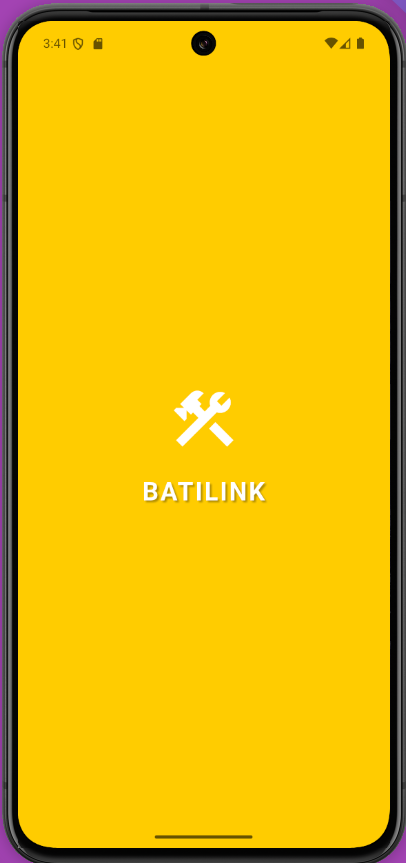

# batilink_mobile_app

A new Flutter project.

## Getting Started

This project is a starting point for a Flutter application.

A few resources to get you started if this is your first Flutter project:

- [Lab: Write your first Flutter app](https://docs.flutter.dev/get-started/codelab)
- [Cookbook: Useful Flutter samples](https://docs.flutter.dev/cookbook)

For help getting started with Flutter development, view the
[online documentation](https://docs.flutter.dev/), which offers tutorials,
samples, guidance on mobile development, and a full API reference.

## TODO

- La page de presentation (onboarding_presentation_screen) est prête

 

- La page de role (onboarding_role_screen) est prête

 

- La page d'authentification (onboarding_auth_choice_screen) est prête
    - L'Espace Client d'authentification
 

    - L'Espace Professionnel d'authentification
 

- La page de login (login_screen) est prête

 

- La page de register (register_screen) est prête

- La page de home (home_screen) est prête
